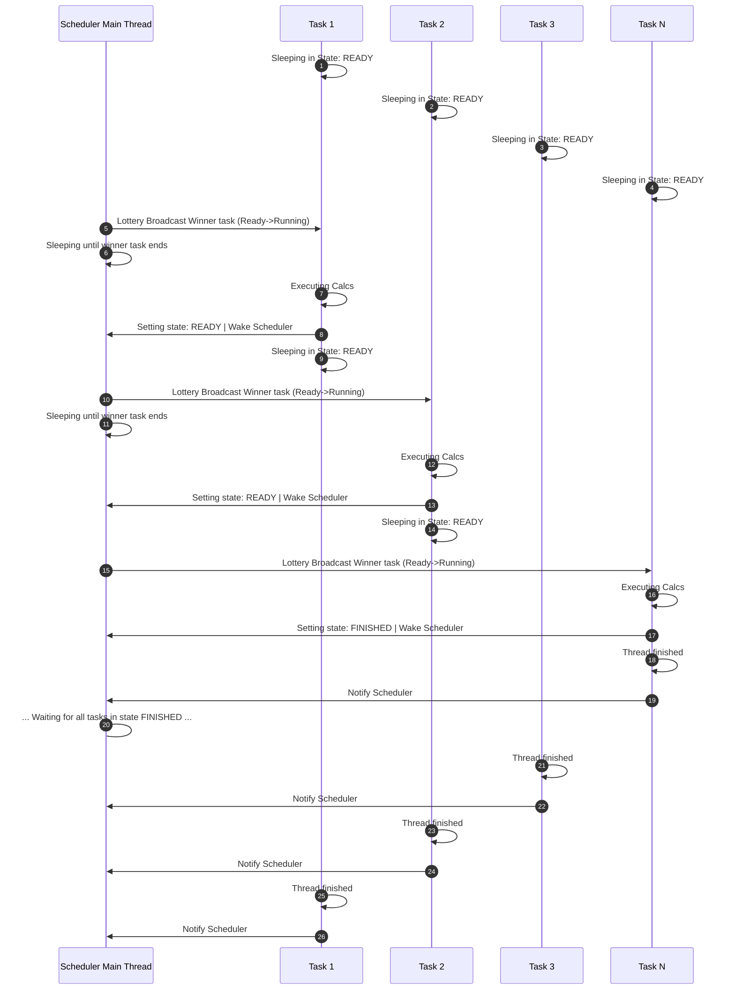

# Lottery Scheduler

Lottery scheduler project for the Advanced Operating Systems course.

## Contributors

| Full name | Student ID | GitHub username |
|---|---:|---|
| Edgar Chaves González | 2017239281 | [Edjchg](https://github.com/Edjchg) |
| Esteban Ureña | 201025605 | [Eur](https://github.com/Eur) |

## Tested development environment

- Ubuntu running through WSL2.
- (Eur's env)
- GCC with C17 support and GNU Make.
- POSIX threads (`pthread`).
- AddressSanitizer and ThreadSanitizer for the checks defined in the Makefile.

## Build and execution

From the repository root:

```bash
make all
```
Or

```bash
make lottery_scheduler
```


This command generates `lottery_scheduler`. To remove generated files:

```bash
make clean
```

# Project build directives with Make

- `make all/lottery_scheduler`: compiles the main scheduler binary `lottery_scheduler`.
- `make clean`: removes compiled binaries and sanitizer artifacts.
- `make test`: builds the scheduler and verifies:
        - Validation: every CSV in `tests/invalid_input_files/` is rejected with a nonzero exit status.
        - Reproducibility: the same input file produces the same result always.
- `make asan`: builds the program with AddressSanitizer enabled.
- `make asan_cooperative`: runs the ASan build in cooperative mode with the sample cooperative command.
- `make asan_quantum`: runs the ASan build in quantum mode with the sample quantum command.
- `make tsan`: builds the program with ThreadSanitizer enabled.
- `make tsan_cooperative`: runs the TSan build in cooperative mode with the sample cooperative command.
- `make tsan_quantum`: runs the TSan build in quantum mode with the sample quantum command.

# Unit test directives

The unit tests are defined under `tests/unit_tests/Makefile` and can be run from that directory:

- `make all`: runs all unit tests.
- `make test_parser`: compiles and runs the parser tests.
- `make test_dll`: compiles and runs the doubly linked list tests.
- `make test_rng`: compiles and runs the RNG tests.
- `make test_summary`: compiles and runs the summary tests.
- `make test_cooperative`: compiles and runs the cooperative-mode tests.
- `make clean`: removes all generated test binaries.

# Runtime parameters

The scheduler accepts the following flags:

- `-i, --input FILE`: path to the task CSV file.
- `-m, --mode MODE`: scheduling mode. Supported values are `quantum` and `cooperative`.
- `-q, --quantum UNITS`: quantum size, required when `--mode quantum` is used.
- `-p, --slice-percent PCT`: percentage of each task's work used for a cooperative slice, required when `--mode cooperative` is used.
- `-s, --seed VALUE`: pseudo-random seed used by the lottery scheduler.
- `-l, --log FILE`: output file for scheduler event logs.
- `-z, --summary FILE`: output file for the execution summary.
- `-d, --max-dispatches N`: maximum number of scheduler dispatches.
- `-h, --help`: prints the available options and usage examples.

`--input`, `--mode`, and `--seed` are required. `--quantum` is required in
`quantum` mode; `--slice-percent` is required in `cooperative` mode. The
`--log` and `--summary` files are optional. When specified, missing parent
directories are created automatically.

# Input CSV format

The input file must include a header row and between 5 and 25 tasks. Each row
contains three positive integers separated by commas:

```csv
task_id,tickets,work_units
1,1,1
2,1,1
3,1,1
4,1,1
5,5,1000000000
```

`task_id` must be unique. `tickets` determines the probability of winning the
lottery, and `work_units` is the amount of work assigned to the task. The
example is available in `tests/base.csv`.

# Example executions

## Quantum mode
```bash
./lottery_scheduler --input tests/base.csv --mode quantum --quantum 1000 --seed 2026 --log results/base_events.csv --summary results/base_summary.csv
```

## Cooperative mode
```bash
./lottery_scheduler --input tests/base.csv --mode cooperative --slice-percent 10 --seed 2026 --summary results/base_summary.csv
```

## ASan cooperative mode
```bash
make asan_cooperative
```

## ASan quantum mode
```bash
make asan_quantum
```

## TSan cooperative mode
```bash
make tsan_cooperative
```

## TSan quantum mode
```bash
make tsan_quantum
```

# Repository structure

```text
include/                    Public project headers
src/                        Parser, scheduler, logger, and task implementation
tests/base.csv              Example CSV input
tests/validation_error.csv  Input for validation tests
tests/unit_tests/           Unit tests and their Makefile
results/                    Example CSV results
scripts/                    Experiment scripts
Makefile                    Build, test, and sanitizer targets
README.md                   Project documentation
```

```text
SOA-P1-GrupoCU/
├── Makefile
├── README.md
├── include
│   ├── double_linked_list.h
│   ├── error_def.h
│   ├── logger.h
│   ├── parser.h
│   ├── rng.h
│   ├── scheduler.h
│   └── task.h
├── scripts
│   └── run_experiment.sh
├── src
│   ├── double_linked_list.c
│   ├── logger.c
│   ├── main.c
│   ├── parser.c
│   ├── rng.c
│   ├── scheduler.c
│   └── task.c
└── tests
    ├── base.csv
    ├── unit_tests
    │   ├── Makefile
    │   ├── include
    │   │   └── unit_test_infra.h
    │   ├── test_cooperative.c
    │   ├── test_dll.c
    │   ├── test_parser.c
    │   ├── test_rng.c
    │   └── test_summary.c
    └── validation_error.csv

6 directories, 26 files
```

# Delivery reference

- Repository: [Eur/SOA-P1-GrupoCU](https://github.com/Eur/SOA-P1-GrupoCU)
- Delivery tag: `p1-entrega` (reference only; it is not created by this update).
- Reference commit: `21117e50b84da8d293e2def49516ed7486d4fdc4`.

The tag and delivery commit are not created or modified as part of this update.

# Scheduler sequence




From the Sequence Diagram, it is visible that at the begining, all N tasks remain in READY state, which means they are ready to start executing. All these N tasks are sleeping, waiting for the scheduler to choose among them. 

The scheduler then chooses one task based on the lottery algorithm. It wakes all threads to make them reevaluate if they are the chosen on. The chosen/winner task goes from READY to RUNNING, and start its execution, the rest of the threads remain in sleeping state. When the winner task ends, it decides if it has finished or not, and notify this to the scheduler.

The scheduler retakes the lock and repeat the lottery. When no remaining tasks, or the max dispatches has been reached, then the main loop ends.

