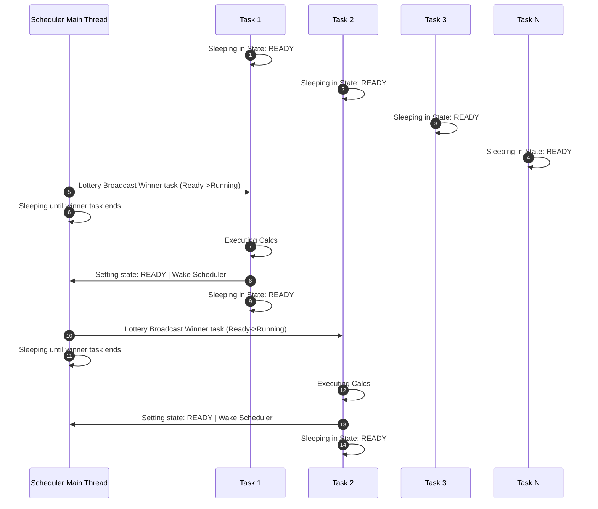

# Authors
- Edgar Chaves. 2017239281. Edjchg
- Esteban Ureña. 201025605. Eur

# Project build directives with Make

- `make all`: compiles the main scheduler binary `lottery_scheduler`.
- `make clean`: removes compiled binaries and sanitizer artifacts.
- `make test`: builds and executes the scheduler with the default `main` entry point.
- `make asan`: builds the program with AddressSanitizer enabled.
- `make asan_cooperative`: runs the ASan build in cooperative mode with the sample cooperative command.
- `make tsan`: builds the program with ThreadSanitizer enabled.
- `make tsan_cooperative`: runs the TSan build in cooperative mode with the sample cooperative command.

# Unit test directives

The unit tests are defined under `tests/unit_tests/Makefile` and can be run from that directory:

- `make all`: runs all unit tests.
- `make test_parser`: compiles and runs the parser tests.
- `make test_dll`: compiles and runs the doubly linked list tests.
- `make test_rng`: compiles and runs the RNG tests.
- `make test_summary`: compiles and runs the summary tests.
- `make test_cooperative`: compiles and runs the cooperative-mode tests.
- `make clean`: removes all generated test binaries.

# Runtime parameters

The scheduler accepts the following flags:

- `-i, --input FILE`: path to the task CSV file.
- `-m, --mode MODE`: scheduling mode. Supported values are `quantum` and `cooperative`.
- `-q, --quantum UNITS`: quantum size, required when `--mode quantum` is used.
- `-p, --slice-percent PCT`: percentage of each task's work used for a cooperative slice, required when `--mode cooperative` is used.
- `-s, --seed VALUE`: pseudo-random seed used by the lottery scheduler.
- `-l, --log FILE`: output file for scheduler event logs.
- `-z, --summary FILE`: output file for the execution summary.
- `-d, --max-dispatches N`: maximum number of scheduler dispatches.
- `-h, --help`: prints the available options and usage examples.

# Example executions

## Quantum mode
```bash
./lottery_scheduler --input tests/base.csv --mode quantum --quantum 1000 --seed 2026 --log results/base_events.csv --summary results/base_summary.csv
```

## Cooperative mode
```bash
./lottery_scheduler --input tests/base.csv --mode cooperative --slice-percent 10 --seed 2026 --summary results/base_summary.csv
```

## ASan cooperative mode
```bash
make asan_cooperative
```

## TSan cooperative mode
```bash
make tsan_cooperative
```

# Scheduler sequence




From the Sequence Diagram, it is visible that at the begining, all N tasks remain in READY state, which means they are ready to start executing. All these N tasks are sleeping, waiting for the scheduler to choose among them. 

The scheduler then chooses one task based on the lottery algorithm. This task goes from READY to RUNNING, and start its execution. When it ends, it decides if it has finished or not, and notify this to the scheduler.

The scheduler retakes the lock and repeat the lottery. When no remaining tasks, or the max dispatches has been reached, then the main loop ends.

# Notes

- The scheduler validates that required parameters are present and rejects invalid values.
- The `--log` flag is optional, but when provided the directory must already exist.
- `--summary` is also required for the execution summary output, as enforced by the parser.
